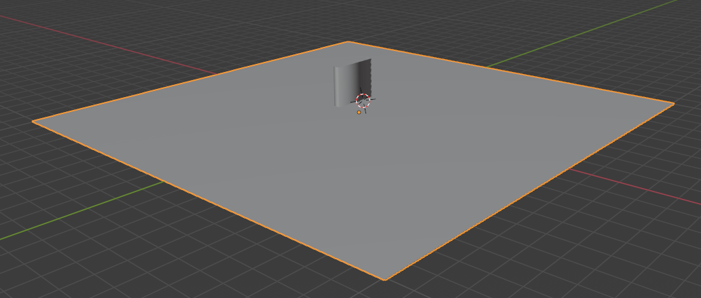

# nav_test_bump.obj Description

This file contains a square plane centered about the origin. The edge length is 202 units. Slightly off center is an extrusion of the plane (-11,.5) to (-14.6,-21.4). This file tests obstacles that are only one mesh.

